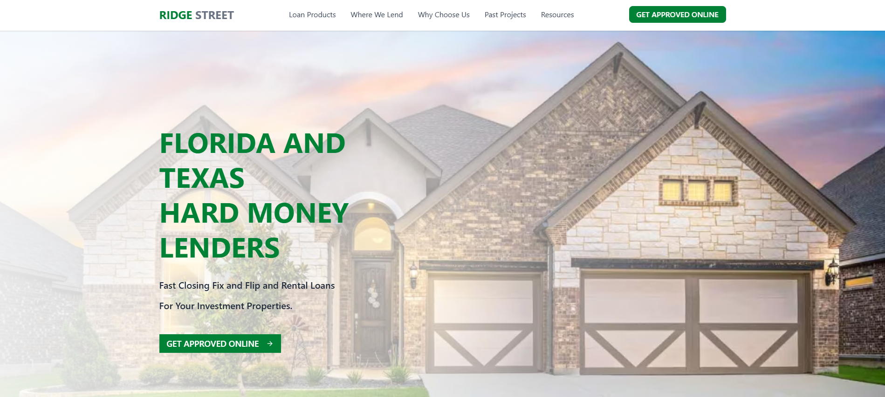
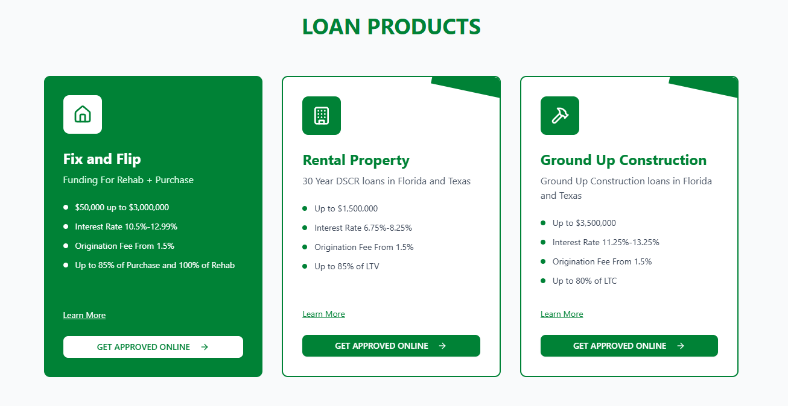
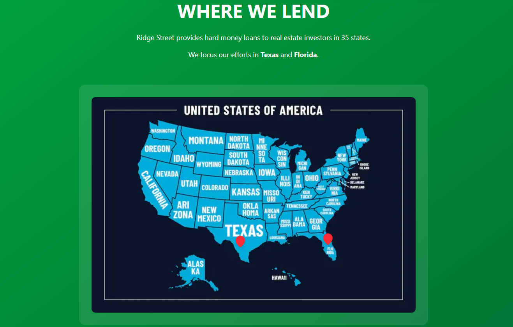
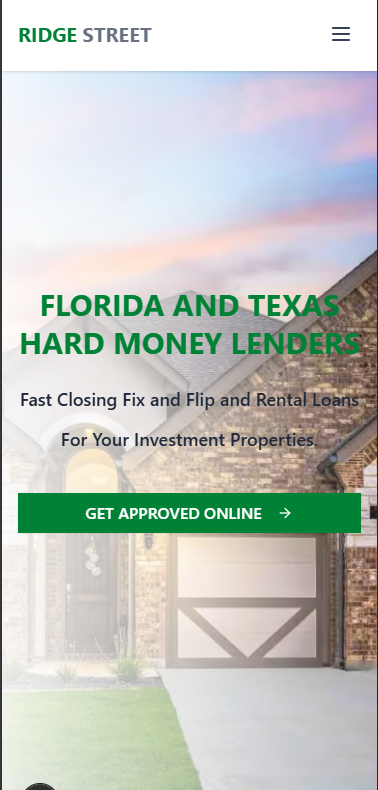

# Ridge Street Capital - Real Estate Lending Platform

A modern, responsive website for Ridge Street Capital, a real estate lending company specializing in fix & flip loans, rental property financing, and ground-up construction loans. Built with Next.js and featuring smooth animations, interactive components, and a professional design.
## Live link
https://real-estate-loan.vercel.app/
## Features

- **Responsive Design**: Mobile-first approach with seamless desktop experience
- **Smooth Animations**: Framer Motion powered scroll animations and transitions
- **Interactive Components**: Carousels, testimonials, and project showcases
- **Professional Loading Screen**: Branded loading animation with progress indicator
- **Modern UI**: Clean design with gradient overlays and professional typography
- **Optimized Performance**: Next.js Image optimization and efficient component architecture

## Project Setup Instructions

### Prerequisites

- Node.js 18+ installed on your system
- npm, yarn, pnpm, or bun package manager

### Installation

1. **Clone the repository**

   ```bash
   git clone <repository-url>
   cd real-estate-loan
   ```

2. **Install dependencies**

   ```bash
   npm install
   # or
   yarn install
   # or
   pnpm install
   # or
   bun install
   ```

3. **Run the development server**

   ```bash
   npm run dev
   # or
   yarn dev
   # or
   pnpm dev
   # or
   bun dev
   ```

4. **Open your browser**
   Navigate to [http://localhost:3000](http://localhost:3000) to see the application.

### Build for Production

```bash
npm run build
npm run start
```

## Tools & Packages Used

### Core Framework

- **Next.js 15.4.3** - React framework with App Router
- **React 19.1.0** - UI library
- **TypeScript 5** - Type safety and better development experience

### UI & Styling

- **Tailwind CSS 4** - Utility-first CSS framework
- **ShadCN UI Components** - Pre-built accessible components
- **Radix UI** - Headless UI primitives
- **Lucide React** - Beautiful icon library
- **Class Variance Authority** - Component variant management
- **Tailwind Merge** - Utility class merging

### Animations & Interactions

- **Framer Motion 12.23.9** - Production-ready motion library
- **tw-animate-css** - Additional Tailwind animations

### Development Tools

- **ESLint** - Code linting and formatting
- **PostCSS** - CSS processing
- **Turbopack** - Fast bundler for development

### Additional Libraries

- **React Google Maps API** - Map integration (replaced with static approach)
- **clsx** - Conditional className utility

## Project Structure

```
src/
├── app/
│   ├── globals.css          # Global styles and animations
│   ├── layout.tsx           # Root layout component
│   └── page.tsx             # Main page with all sections
├── components/
│   ├── Footer.tsx           # Site footer
│   ├── LoadingScreen.tsx    # Initial loading animation
│   ├── Navbar.tsx           # Navigation with smooth scrolling
│   └── StaggeredAnimation.tsx # Animation wrapper component
├── pages/
│   ├── Homepage.tsx         # Hero section
│   ├── LoanProducts.tsx     # Loan product cards
│   ├── WhereWeLend.tsx      # Lending areas with map
│   ├── WhyChooseUs.tsx      # Features and testimonials
│   ├── PastProjects.tsx     # Project showcase
│   ├── InterestedInWorking.tsx # Action cards
│   ├── OtherResources.tsx   # Blog and resources
│   └── ReadyToGetStarted.tsx # Final CTA section
├── hooks/                   # Custom React hooks
└── lib/                     # Utility functions
```

## Screenshots

### Homepage Hero Section



### Loan Products



### Interactive Map



### Mobile Responsive Design



## Development Notes

- The project uses a modular component architecture for easy maintenance
- All animations are GPU-accelerated using Framer Motion
- Images are optimized using Next.js Image component
- The design follows mobile-first responsive principles
- Custom CSS animations are defined in `globals.css`
- Navigation uses smooth scrolling to different page sections

## Deploy on Vercel

The easiest way to deploy your Next.js app is to use the [Vercel Platform](https://vercel.com/new?utm_medium=default-template&filter=next.js&utm_source=create-next-app&utm_campaign=create-next-app-readme) from the creators of Next.js.

Check out the [Next.js deployment documentation](https://nextjs.org/docs/app/building-your-application/deploying) for more details.
